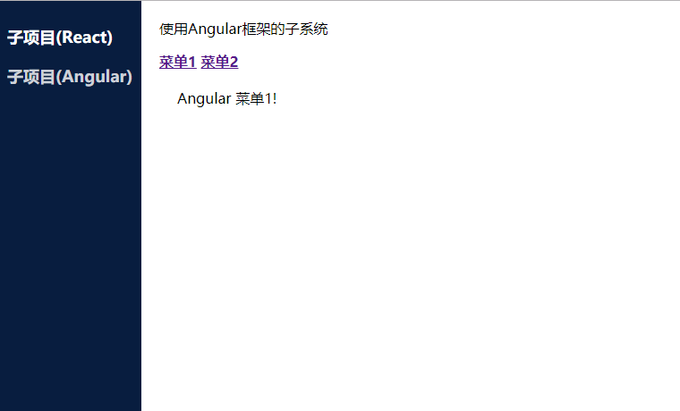

# jin-single-spa
A simple example of how to use webpack with single-spa to learn more about single-spa itself.

## [single-spa](https://single-spa.js.org/)
single-spa is a framework for bringing together multiple javascript microfrontends in a frontend application. Architecting your frontend using single-spa enables many benefits, such as:

 - Use multiple frameworks on the same page without page refreshing (React, AngularJS, Angular, Ember, or whatever you're using)
 - Deploy your microfrontends independently.
 - Write code using a new framework, without rewriting your existing app
 - Lazy load code for improved initial load time.

---
This repository hopefully will be helpful for starting your own single-spa project. It has a react application and an angular application coexisting in a minimalistic way. If this project turns out to be helpful to people, I can add some more documentation, comments in the code, etc.

## How to use it
1. Clone this project
2. `yarn install` (or `npm install`)
3. `yarn watch` (or `npm run watch`)
4. Open up http://localhost:8080 in a web browser.
