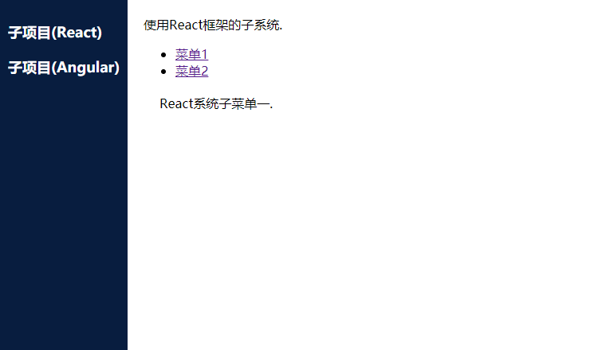

# simple-single-spa-webpack-example
A simple example of how to use webpack with [single-spa](https://single-spa.js.org/) to learn more about single-spa itself.

This repository hopefully will be helpful for starting your own single-spa project. It has a react application and an angular application coexisting in a minimalistic way. If this project turns out to be helpful to people, I can add some more documentation, comments in the code, etc.

## How to use it
1. Clone this project
2. `yarn install` (or `npm install`)
3. `yarn watch` (or `npm run watch`)
4. Open up http://localhost:8080 in a web browser.
